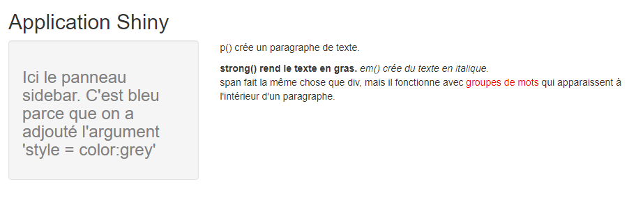
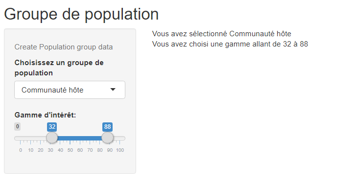
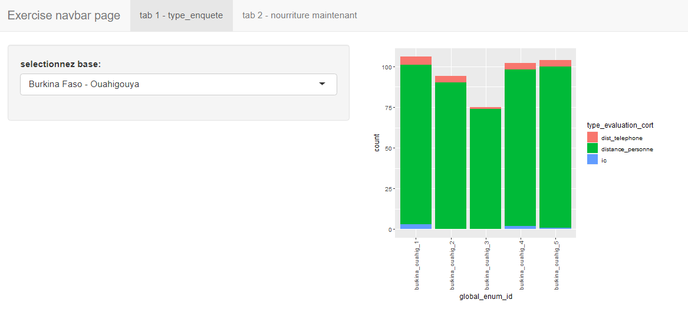
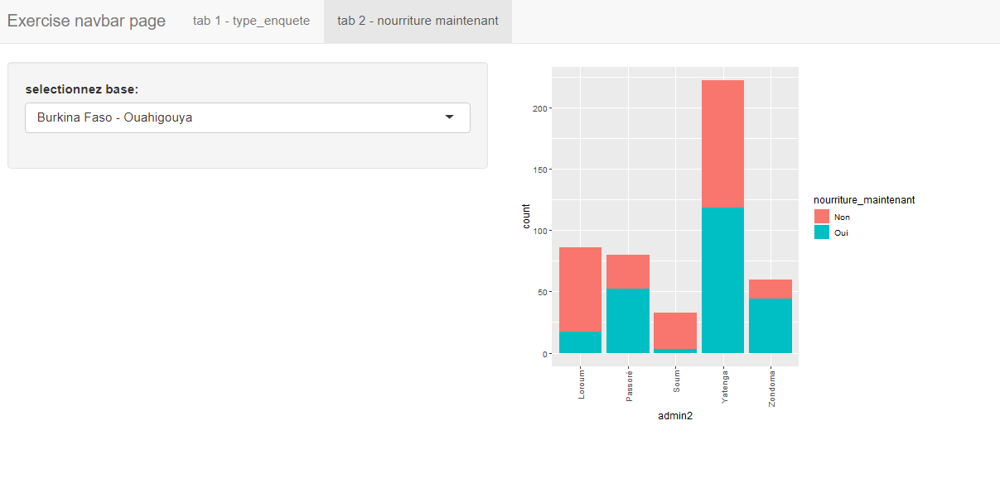

## 7. Shiny
### 7. Introduction a Applications Shiny

***

#### Liens clés

[Documentation Shiny](https://www.rdocumentation.org/packages/shiny/versions/1.6.0) <br>

[Tutorial Shiny](https://shiny.rstudio.com/tutorial/written-tutorial/lesson1/) <br>

[Tutorial en francais](http://perso.ens-lyon.fr/lise.vaudor/Tuto_Shiny/) <br>

[Shiny Widgets Gallery](https://shiny.rstudio.com/gallery/widget-gallery.html) <br>


***

### Shiny

Shiny est un package R qui facilite la création d'applications Web interactives directement avec R.

<br>Applications Shiny contiennent un script qui s'appele **app.R**, dans un projet R. Dans le script de app.R il y a trois composants:

* Un objet de **ui** (interface utilisateur) qui contrôle la disposition et l'apparence

* Une fonction de **server**

* Un appel a la fonction de **shinyApp**, qui crée des objets d'application Shiny à partir d'une paire défini.

***

Installez et chargez le package de shiny:
```{r eval=T, include=F}
library(shiny)
```

```{r eval=F, echo=T}
install.packages("shiny")
library(shiny)
```

***

Une description simplifiée du contenu d'une application Shiny:

```{r eval=F, echo=T}
ui <- ...

server <- ...

shinyApp(ui, server)
```

Maintenant on va creer un application basique. C'est le plus courant utiliser la fonction **fluidPage** pour creer le UI. Pour le moment on va laisser vide le server. titlePanel et sidebarLayout sont les deux éléments les plus populaires à ajouter à fluidPage. Ils créent une application Shiny de base avec une barre latérale.

```{r eval=F, echo=T}
# Definez UI ----
ui <- fluidPage(
  titlePanel("panneau de titre"),
  sidebarLayout(
    sidebarPanel("panneau sidebar"),
    mainPanel("panneau principal")
  )
)
# Definez logique du serveur ----
server <- function(input, output) {
}
# Lancez la app
shinyApp(ui, server)
runApp("ma_app") # avec le nom de l'application
```

***

### Contenu HTML 

On ajoute texte de HTML comme fonctions appelé avec les memes noms des tags HTML:
```{r eval=F, echo=T}
# Definez UI ----
ui <- fluidPage(
  titlePanel("Application Shiny"),
  sidebarLayout(
    sidebarPanel( img(src = "www/reach_logo.png", height = 100, width = 200),
                  h3("Ici le panneau sidebar. C'est gris parce qu'on a adjouté l'argument 'style = color:grey' ", style = "color:grey")),
    mainPanel(
      p("p() crée un paragraphe de texte."),
      strong("strong() rend le texte en gras."),
      em("em() crée du texte en italique."),
      br(),
      p("span fait la même chose que div, mais il fonctionne avec",
        span("groupes de mots", style = "color:red"),
        "qui apparaissent à l'intérieur d'un paragraphe.")
    )
  )
)
# Definez logique du serveur ----
server <- function(input, output) {
}
# Lancez la app
shinyApp(ui, server)
```

**Resultats:**



#### Exercise 

* creez un petite UI Shiny de la même manière que ci-dessus et peuplez les panneaux sidebar et main avec texte des plusieurs formes HTML.

***

### Contrôle des widgets

Les widgets sont des éléments Web avec lesquels vos utilisateurs peuvent interagir. Les widgets permettent à vos utilisateurs d'envoyer des messages à l'application Shiny.

Types des widgets:
```{r echo=FALSE, warning=F}
widgets <- tribble(~nom_widget, ~description,
                "actionButton", "un bouton pour effectuer des actions",
                "checkboxInput","Une seule case à cocher",
                "dateInput", "Saisissez une date",
                "fileInput","Télécharger un fichier",
                "radioButtons", "Un ensemble de boutons radio pour sélectionner une entrée",
                "selectInput", "menu déroulant sélectionnez",
                "sliderInput","choisissez une valeur numérique dans un curseur",
                "submitButton", "un bouton pour soumettre des réponses",
                "textInput", "Saisissez un texte",
                )

source("R/functions.R")

clean_table(widgets, 300)
```

Pour apprendre plus visitez le [Shiny Wudgets Gallery](https://shiny.rstudio.com/gallery/widget-gallery.html) <br>

***

### Ajouter des widgets

Nous ajoutons des widgets de la même manière que nous avons ajouté d'autres types de contenu HTML, dans l'objet de UI. Chaque fonction de widget nécessite plusieurs arguments. Les deux premiers arguments de chaque widget sont: 

* un **nom** pour le widget: l'utilisateur ne verra pas ce nom, mais vous pouvez l'utiliser pour accéder à la valeur du widget. Le nom doit être une chaîne de caractères.

* une **étiquette**: cette étiquette apparaîtra avec le widget dans votre application. Il doit s'agir d'une chaîne de caractères, mais il peut s'agir d'une chaîne vide "".

Les arguments restants varient d'un widget à l'autre, en fonction de ce dont le widget a besoin pour faire son travail. Ils incluent des éléments tels que les valeurs initiales, les plages et les incréments. Vous pouvez trouver les arguments exacts nécessaires à un widget sur la page d'aide de la fonction de widget, comme **?SelectInput**.

Voici des exemples des types de widgets arrangés comme **fluidRow** dans un fluidPage. indique que va adapter a le largeur du navigateur. Dans chaque fluidRow on define des colonnes - le premier argument est la **largeur de la colonne.**
```{r eval=F, echo=T}
# Definez UI ----
ui <- fluidPage(
  titlePanel("Application Shiny"),
  fluidRow(
    column(6, 
           sliderInput("slider1", h3("input curseur"),
                       min = 0, max = 100, value = 50),
           sliderInput("slider2", "",
                       min = 0, max = 100, value = c(25, 75))
    ),
    column(3,
           h3("Case à cocher unique"),
           checkboxInput("checkbox", "Choix A", value = TRUE)),
  
  ),
  fluidRow(
    column(6, 
           checkboxGroupInput("checkGroup", 
                              h3("Case à cocher multiple"), 
                              choices = list("choix 1" = 1, 
                                             "choix 2" = 2, 
                                             "choix 3" = 3),
                              selected = 1)),
    column(3,
           fileInput("file", h3("Télécharger un fichier"))),
  ),
  fluidRow(
    column(6,
           radioButtons("radio", h3("Boutons radio"),
                        choices = list("Choice 1" = 1, "Choice 2" = 2,
                                       "Choice 3" = 3),selected = 1)),
    column(3,
           selectInput("select", h3("menu déroulant"), 
                       choices = list("choix 1" = 1, 
                                      "choix 2" = 2,
                                      "choix 3" = 3), 
                       selected = 1)),
  )
)
# Definez logique du serveur ----
server <- function(input, output) {
}
# Lancez la app
shinyApp(ui, server)
```

***

### Afficher les outputs réactives

#### Regles pour outputs réactives
* utilisez une fonction **Output** dans **l'interface utilisateur** pour placer des objets réactifs dans votre application Shiny.
* utilisez une fonction **render** sur **le serveur** pour indiquer à Shiny comment construire vos objets.
* entourer les expressions R par des accolades, {}, dans chaque fonction render.
* enregistrez vos expressions de "render" dans la liste de sortie, avec une entrée pour chaque objet réactif de votre application.
* créer de la réactivité en incluant une valeur d'entrée dans une expression de "render".


Types des outputs:
```{r echo=FALSE, warning=F}
outputs <- tribble(~fonction_render, ~fonction_output, ~crée,
                "renderDataTable","dataTableOutput", "DataTable",
                "renderImage","imageOutput","images (enregistrées sous forme de lien vers un fichier source)",
                "renderPlot","plotOutput",  "Graphiques Base R",
                "renderTable","tableOutput",  "Tableaux",
                "renderText","TextOutput",  "Texte",
                "renderUI","uiOutput", "un objet de balise Shiny ou HTML",
                "renderLeaflet","leafletOutput",  "carte Leaflet",
                "renderPlotly","plotlyOutput", "graphiques de package Plotly",
                "recerHighchart","highchartOutput",  "graphiques de package Highcharter",
                )

source("R/functions.R")

clean_table(outputs, 300)
```


***
Example de un output réactive
```{r eval=F, echo=T}
ui <- fluidPage(
  titlePanel("Groupe de population"),
  
  sidebarLayout(
    sidebarPanel(
      helpText("Create Population group data"),
      
      selectInput("var", 
                  label = "Choisissez un groupe de population",
                  choices = c("PDI", 
                              "Communauté hôte", 
                              "Refugie"),
                  selected = "Communauté hôte"),
      
      sliderInput("range", 
                  label = "Gamme d'intérêt:",
                  min = 0, max = 100, value = c(0, 100))
    ),
    
    mainPanel(
      textOutput("selected_var"),
      textOutput("min_max")
    )
  )
)

server <- function(input, output) {
  
  output$selected_var <- renderText({ 
    paste("Vous avez sélectionné", input$var)
  })
  
  output$min_max <- renderText({ 
    paste("Vous avez choisi une gamme allant de",
          input$range[1], "à", input$range[2])
  })
  
}

shinyApp(ui, server)
```
**Resultats:**


*** 

```{r eval=F, echo=T}

library(shiny)
library(plotly)
library(dplyr)
library(ggplot2)

# global - manipulation des donnees
# lisez les donnees HSM
data <- read.csv("donnees/tableaux/REG1903b_3_Frontiers_HSM_Burkina_Faso_2021-03-16.csv",
                 stringsAsFactors = F,
                 na.strings = c("NA", "N/A",""),
                 encoding="UTF-8")

data$type_evaluation_cort <- case_when(data$type_evaluation == "J'évalue la localité à distance avec un informateur-clé EN PERSONNE" ~ "distance_personne",
                                  data$type_evaluation == "J'évalue la localité à distance avec un informateur-clé PAR TÉLÉPHONE" ~ "dist_telephone",
                                  data$type_evaluation == "Visites terrains - Je suis dans la localité évaluée avec l'informateur-clé" ~ "ic")

# objet UI
ui <- bootstrapPage(
        navbarPage("Exercise navbar page",
                 tabPanel("tab 1 - type_enquete",
                          sidebarLayout(
                            sidebarPanel(
                                    selectInput("region",
                                                "selectionnez base:",
                                                choices = sort(unique(data$base)))
                            ),
                            mainPanel(
                              plotOutput(outputId = "graphique_stacked", height = "400px", width = "450px"),
                            )
                          )),
                 tabPanel("tab 2 - nourriture maintenant",
                          sidebarLayout(
                            sidebarPanel(
                              selectInput("region2",
                                          "selectionnez base:",
                                          choices = sort(unique(data$base)))
                            ),
                            mainPanel(
                              plotOutput(outputId = "graphique_stacked2", height = "400px", width = "450px"),
                            )
                          ))
)
)
# fonction de server 
server <- function(input, output, session) {
  
  output$graphique_stacked <- renderPlot({
    
    region <- input$region
    
    data_filtree <- data %>% 
      filter(base == region)
    
    ggplot(data_filtree) + 
      geom_bar(aes(x = global_enum_id, fill = type_evaluation_cort))+ 
      theme(axis.text.x = element_text(angle = 90, vjust = 0.5, hjust=1))
  })
  
  output$graphique_stacked2 <- renderPlot({
    
    region2 <- input$region2
    
    data_filtree2 <- data %>% 
      filter(base == region2)
    
    ggplot(data_filtree2) +
      geom_bar(aes(x = admin2, fill = nourriture_maintenant))+
      theme(axis.text.x = element_text(angle = 90, vjust = 0.5, hjust=1))
  })
}

# lancer l'application
shinyApp(ui, server)


```
**Resultats:**




***
#### Exemples intégrés. 
Le package Shiny est livré avec de nombreux exemples que nous pouvons consulter pour nous aider:

```{r eval=F, echo=T}
runExample("01_hello")      # un histogramme
runExample("02_text")       # tableaux et blocs de données
runExample("03_reactivity") # une expression réactive
runExample("04_mpg")        # variables globales
runExample("05_sliders")    # barres de défilement
runExample("06_tabsets")    # panneaux à onglets
runExample("07_widgets")    # texte d'aide et boutons d'envoi
runExample("08_html")       # Application Shiny construite à partir de HTML
runExample("09_upload")     # assistant de téléchargement de fichiers - upload
runExample("10_download")   # assistant de téléchargement de fichiers - downlaod
runExample("11_timer")      # une minuterie automatisée
```
